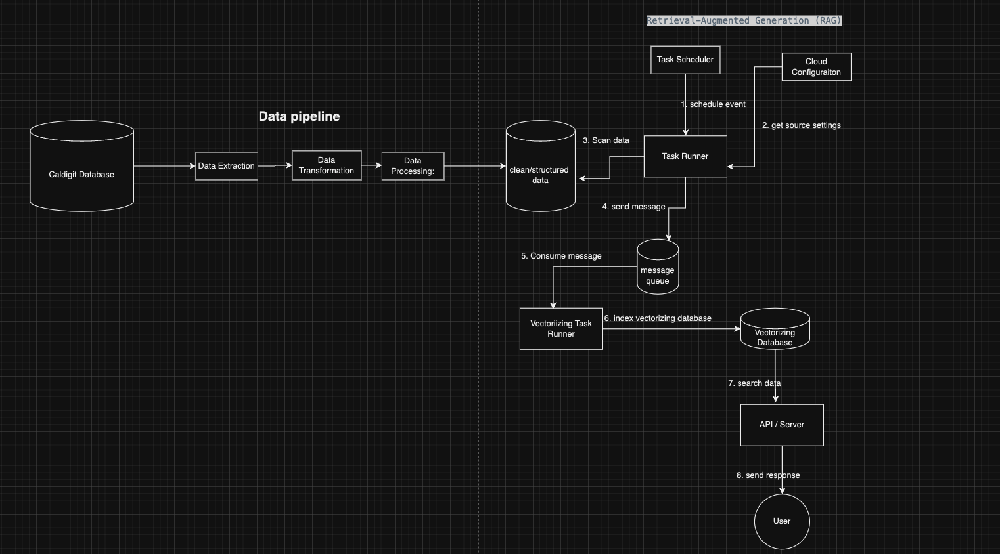

# Customer support Chatbot Product Documentation
## Functional Requirement 
   1. The chatbot should support user authentication to verify the identity of users
   2. The ability to initiate and maintain natural and context-aware conversations with users
   3. Interpretation of natural language input from users
   4. Identify the user's intent based on their input
   5. Capability to understand and respond in multiple languages to cater to a diverse user base
   6. Proper handling of errors and the ability to gracefully manage situations where user queries cannot be processed

## Non-Functional Requirement 
   1. Performance:
      a. The chatbot should respond promptly, with low latency, ensuring a seamless user experience 
      b. It should be capable of handling a specified number of concurrent users and messages
   2. Reliability:
      a. The chatbot should be available and reliable, with a high uptime percentage
   3. Resource Utilization:
      a. Efficient utilization of computing resources to optimize costs and performance.
    
## Currently, there are two mainstream approaches to training a customer support chatbot.
1. Embedding-Based Search Tool with LLM (Retrieval-Augmented Generation - RAG):
    A method that breaks down information, converts it into vectors, 
    and uses a vector database to retrieve relevant data for generating intelligent and user-friendly chatbot responses.

   1. **Chunking the Content:**
      - Break down a large body of text into smaller, manageable chunks or segments.
      - This addresses the context window limit or the maximum amount of information an LLM (chatgpt) can process at once.

   2. **Embedding the Chunks:**
      - Embed each chunk using embedding methods from Hugging Face or LangChain.
      - The embedding process converts textual information into vector representations.

   3. **Building a Vector Database:**
      - Store the embedded chunks in a vector database.
      - The vector database enables efficient similarity searches based on the embeddings.

   4. **User Query Handling:**
      - When a user sends a query to the chatbot, embed the query using the same method.
      - Search the vector database for similar chunks based on the embedded query.

   5. **Retrieval of Similar Results:**
      - Retrieve chunks from the vector database that are similar to the embedded query.
      - This ensures relevant information is retrieved for generating responses.

   6. **Passing Results to the LLM:**
      - Pass the retrieved results to the Language Learning Model (LLM).
      - The LLM uses the information from the retrieved chunks to formulate more intelligent and context-aware responses.

   7. **Generating User-Friendly Responses:**
      - The LLM generates responses based on the combined information from the user query and the retrieved relevant chunks.
      - Responses are formulated in a user-friendly and contextually relevant manner.

   8. **User Interaction:**
      - Present the generated responses to the user through the chatbot interface.
      - The chatbot provides intelligent answers that incorporate knowledge from the vector database.
   
2. Fine-Tuning Language Learning Model (LLM):
   A process of customizing a pre-trained language model for specific tasks or domains, 
   involving dataset preparation, model training, validation, and iterative improvement.

   2. **Selecting a Pre-Trained Model:**
      - Choose a pre-trained language model as the base for fine-tuning. Options include GPT-3, GPT-4, etc.

   2. **Preparing the Fine-Tuning Dataset:**
      - Assemble a dataset specific to the task or domain you want the model to excel in.
      - The dataset should include examples of inputs and desired model outputs.

   3. **Configuring Fine-Tuning Hyperparameters:**
      - Define hyperparameters for fine-tuning, such as learning rate, batch size, and training epochs.
      - These parameters influence the fine-tuning process and model performance.

   4. **Fine-Tuning the Model:**
      - Train the selected pre-trained model using the prepared dataset.
      - Fine-tuning adapts the model to the specifics of the provided dataset.

   5. **Validation and Evaluation:**
      - Assess the fine-tuned model's performance using a validation dataset.
      - Evaluate metrics such as accuracy, precision, recall, and F1 score.

   6. **Adjusting Hyperparameters (Optional):**
      - Fine-tuning might require adjustments to hyperparameters for optimal results.
      - Iteratively refine hyperparameters based on model performance.

   7. **Iterative Fine-Tuning (Optional):**
      - If necessary, perform multiple rounds of fine-tuning to enhance model capabilities.
      - Each iteration refines the model's understanding and performance.

   8. **Testing with Real-world Data:**
      - Assess the fine-tuned model's performance with real-world data relevant to the intended application.
      - Real-world testing provides insights into the model's practical utility.

### Both requires the following steps: 

   1. **Deployment (Optional):**
      - Deploy the fine-tuned model for integration into applications or services.
      - Deployment makes the model available for generating responses to user queries.

   2. **Monitoring and Maintenance (Post-Deployment):**
       - Implement monitoring mechanisms to track the model's performance in real-world scenarios.
       - Periodically reevaluate and update the model to maintain relevance and effectiveness.

   3. **User Feedback and Iterative Improvement:**
       - Collect feedback from users interacting with the model.
       - Use user feedback to identify areas for improvement and guide further iterations.

### Why Choose Retrieval-Augmented Generation (RAG) over fine-tuning model:
   **Cost-Effectiveness:**
     - Retrieval-Augmented Generation (RAG) has lower upfront costs compared to fine-tuning.
     - Efficient for quick searches without extensive training.
   
   **Efficient Information Retrieval:**
     - Well-suited for scenarios where the goal is to retrieve relevant information from a knowledge base.
     - Embeddings enable efficient similarity searches, especially for unstructured data.
   
   **Flexibility and Adaptability:**
      - Can be used for both chat and instruction following, providing flexibility in interactions.
      - Embeddings offer flexibility in formatting unstructured data.
   
   **Ease of Implementation:**
      - Implementation of an embedding-based search tool is straightforward.
     - Well-suited for internal needs and quick deployment.
   
   **Scalability:**
      - Retrieval-Augmented Generation (RAG) with vector databases can scale well for large datasets.

# Data pipeline and Retrieval-Augmented Generation (RAG) Architecture 
    In this graph, I replaced the technical jargon with understandable terms. 
    We need to evaluate and choose the specific technical stacks once I evaluate the project in-depth.

    
# Timeline to create chatbot:
   1. Data Pipeline: 1.5 months
   2. Vectorized Database Creation: 1 month
   3. OpenAPI Integration (ChatGPT): 1 month
   4. Testing and Maintenance: 1 month

The most time-consuming part is to create clean structured data. Without good data, our chatbot won't respond with accurate messages. 
That is why we need time to do both manually and automatically to complete those steps in order to get high-quality data.

